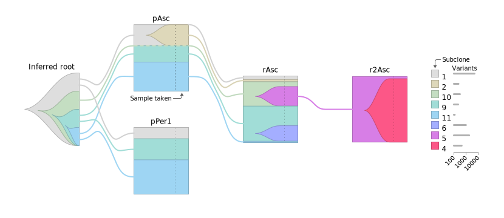

# Jellyfish Plotter – a tumor evolution visualization tool

This tool automates the creation of Jellyfish plots based on the output from
ClonEvol or similar tools that infer tumor phylogeny and subclonal composition.
The Jellyfish visualization was first introduced in the following paper:
Lahtinen, A., Lavikka, K., Virtanen, A., et al. "Evolutionary states and
trajectories characterized by distinct pathways stratify patients with ovarian
high-grade serous carcinoma." _Cancer Cell_ **41**, 1103–1117.e12 (2023). DOI:
[10.1016/j.ccell.2023.04.017](https://doi.org/10.1016/j.ccell.2023.04.017).

The documentation is a work in progress.

<p align="center">
  
</p>

## Getting started

Jellyfish Plotter is a web application written in JavaScript. You need to have
[Node.js](https://nodejs.org/) installed to run the tool.

1. `git clone https://github.com/HautaniemiLab/jellyfish.git` (or download the
   repository as a [ZIP archive]())
2. `cd jellyfish`
3. `npm install`
4. `npm run dev` (starts a development server)

Once the development server is running, open your browser and navigate to
http://localhost:5173/. You should see the Jellyfish Plotter interface, which
allows you to render Jellyfish plots based on your data.

## Input Data

Jellyfish reads input data from the `data/` directory. The data format is
detailed below, with example data available in the `data/` directory.

To use your own data, it is recommended to place it in a separate directory,
such as `private-data/`, which is excluded from the Git repository. Then, create
a `.env.local` file (see the Vite
[docs](https://vitejs.dev/guide/env-and-mode.html#env-files) for details) at the
project root with the following content to use the new data directory:

```sh
VITE_DATA_DIR=private-data
```

The structure of the required data files is described below. For datasets
containing a single patient, the `patient` columns can be omitted.

### `samples.tsv`

The `rank` column specifies the position of each sample in the Jellyfish plot.
For example, different stages of a disease can be ranked in chronological order:
diagnosis (1), interval (2), and relapse (3). The zeroth rank is reserved for
the root of the sample tree. Ranks can be any integer, and unused ranks are
automatically excluded from the plot. If the `rank` column is absent, ranks are
assigned based on each sample’s depth in the sample tree.

The `parent` column identifies the parent sample for each entry. Samples without
a specified parent are treated as children of an imaginary root sample.

#### Example

| sample         | displayName | rank | parent        | patient |
| -------------- | ----------- | ---- | ------------- | ------- |
| P1_iOme_DNA1   | iOme        | 5    |               | P1      |
| P1_iPer1_DNA1  | iPer1       | 5    | P1_pPer1_DNA1 | P1      |
| P1_pAsc_DNA1   | pAsc        | 1    |               | P1      |
| P1_pPer1_DNA1  | pPer1       | 1    |               | P1      |
| P2_iOme2_DNA1  | iOme2       | 5    | P2_pOme2_DNA1 | P2      |
| P2_iOvaR1_DNA1 | iOvaR1      | 5    |               | P2      |
| P2_pOme2_DNA1  | pOme2       | 1    |               | P2      |

### `phylogeny.tsv`

The `subclone` column specifies subclone IDs, which can be any string. The
`parent` column designates the parent subclone. A subclone without a parent is
considered the root of the phylogeny.

If the `color` column is omitted, colors will be generated automatically.

#### Example

| subclone | parent | color   | branchLength | patient |
| -------- | ------ | ------- | ------------ | ------- |
| 1        |        | #cccccc | 2745         | P1      |
| 2        | 1      | #a6cee3 | 54           | P1      |
| 3        | 1      | #b2df8a | 270          | P1      |
| 5        | 1      | #ff99ff | 216          | P1      |
| 1        |        | #cccccc | 1914         | P2      |
| 4        | 5      | #cab2d6 | 2581         | P2      |
| 5        | 1      | #ff99ff | 1314         | P2      |
| 6        | 1      | #fdbf6f | 1651         | P2      |
| 7        | 6      | #fb9a99 | 137          | P2      |
| 8        | 4      | #bbbb77 | 462          | P2      |

### `subclones.tsv`

Subclonal compositions are represented by the clonal prevalence of each subclone
in each sample. The clonal prevalences in a sample must sum to 1.

#### Example

| sample         | subclone | clonalPrevalence | patient |
| -------------- | -------- | ---------------- | ------- |
| P1_iOme_DNA1   | 1        | 0.842            | P1      |
| P1_iPer1_DNA1  | 1        | 0.78             | P1      |
| P1_pAsc_DNA1   | 1        | 0.174            | P1      |
| P1_pPer1_DNA1  | 2        | 0.874            | P1      |
| P1_iOme_DNA1   | 3        | 0.158            | P1      |
| P1_iPer1_DNA1  | 3        | 0.22             | P1      |
| P1_pAsc_DNA1   | 3        | 0.1655           | P1      |
| P1_pPer1_DNA1  | 3        | 0.125            | P1      |
| P1_pAsc_DNA1   | 5        | 0.6605           | P1      |
| P2_iOme2_DNA1  | 1        | 0.1              | P2      |
| P2_iOvaR1_DNA1 | 1        | 0.024            | P2      |
| P2_pOme2_DNA1  | 1        | 0.1715           | P2      |
| P2_iOme2_DNA1  | 4        | 0.4995           | P2      |
| P2_iOme2_DNA1  | 5        | 0.401            | P2      |
| P2_pOme2_DNA1  | 5        | 0.309            | P2      |
| P2_iOvaR1_DNA1 | 6        | 0.3105           | P2      |
| P2_iOvaR1_DNA1 | 7        | 0.665            | P2      |
| P2_pOme2_DNA1  | 8        | 0.5195           | P2      |

### `ranks.tsv`

| rank | title       |
| ---- | ----------- |
| 1    | Diagnosis   |
| 2    | Diagnosis 2 |
| 3    | Interval    |
| 4    | Interval 2  |
| 5    | Relapse     |
| 6    | Relapse 2   |
| 7    | Relapse 3   |
| 8    | Relapse 4   |

## About

Copyright (c) 2024 Kari Lavikka. See [LICENSE](LICENSE) for details.

Jellyfish Plotter is developed in [The Systems Biology of Drug Resistance in
Cancer](https://www.helsinki.fi/en/researchgroups/systems-biology-of-drug-resistance-in-cancer)
group at the [University of Helsinki](https://www.helsinki.fi/en).

This project has received funding from the European Union's Horizon 2020
research and innovation programme under grant agreement No. 965193
([DECIDER](https://www.deciderproject.eu/)) and No. 847912
([RESCUER](https://www.rescuer.uio.no/)).
